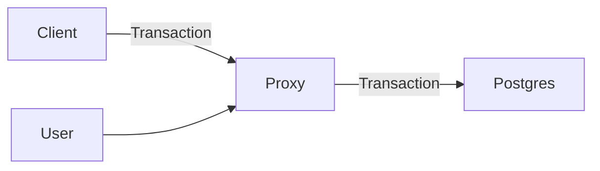
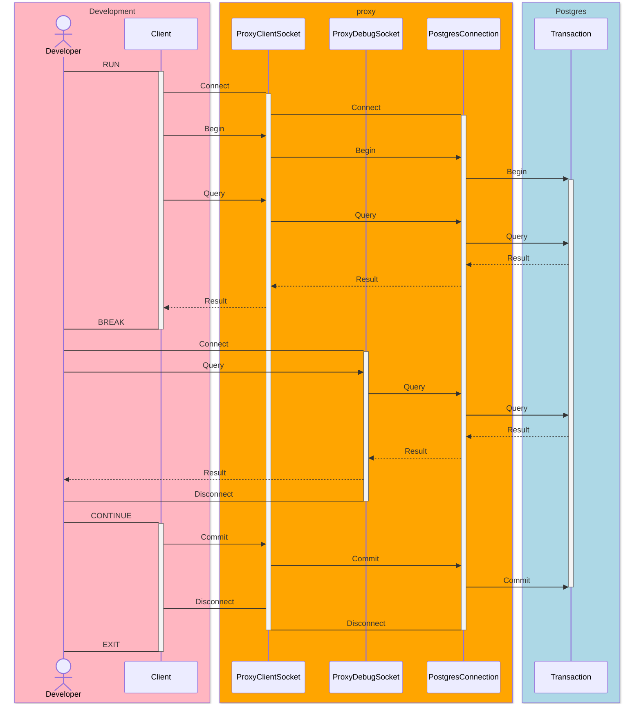
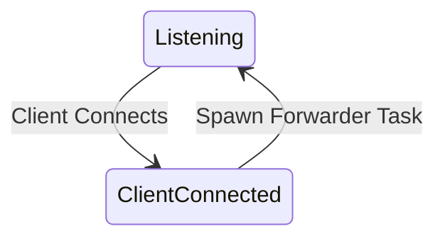
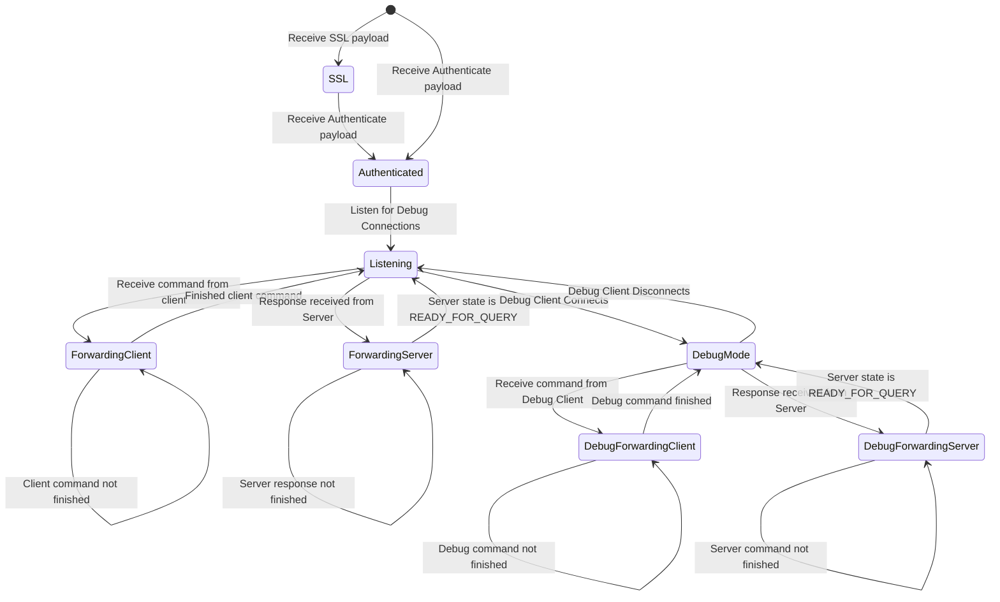

This is a postgres proxy that will allow you to join an uncommitted transaction and perform queries.

The primary use case is during development and debugging. Set a breakpoint in your application/test suite, and then use this proxy to perform queries against the database while the transaction is paused.

## Design
The client application connects through the proxy to postgres. The application operates normally. The proxy exposes a second port that allows a developer to connect and perform queries against the database mid transaction.

When the second port is hit, queries will go over the existing connection. From the perspective of the Postgres transaction, it just receives another query.

### State Machines
Internally, we operate via 2 state machine:

#### Client Listener.
When a client connects, we spawn a new forwarder task.

#### Forwarder Task
The forwarder task will listen on a new port for debug connections. It will also listen for commands from the client, forward them to the postgres connection, and relay any responses back to the client. The forwarder task will also listen for debug commands, and forward them to the postgres connection, and relay any responses back to the debug client.

While a debug command is being processed, the forwarder task will not process any client commands. 

